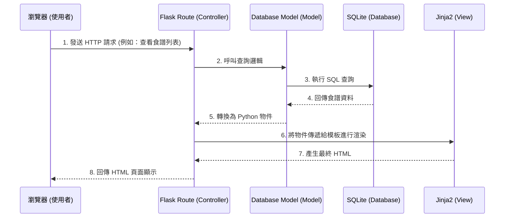

# 食譜收藏系統 - 系統架構設計 (Architecture)

## 1. 技術架構說明

本系統定位為個人的「食譜收藏系統」，強調輕量、快速且易於維護。以下為技術選型與原因：

- **後端框架：Python + Flask**
  - **原因**：Flask 輕巧彈性，學習曲線平緩，非常適合個人專案及中小型應用。它沒有過度設計的負擔，能快速實作路由與邏輯。
- **模板引擎：Jinja2**
  - **原因**：與 Flask 高度整合。本系統不採用前後端分離，而是直接由後端渲染 HTML 頁面，能大幅減少開發初期的複雜度與 API 設計時間。
- **資料庫：SQLite**
  - **原因**：不需要額外架設資料庫伺服器，資料儲存於單一檔案中，非常方便備份與個人使用。搭配 SQLAlchemy (ORM) 或 sqlite3 都可以輕鬆存取資料。

### Flask MVC 模式對應
雖然 Flask 本身不強迫 MVC 架構，但我們將採用類似 MVC 的設計模式來規劃專案：
- **Model (資料模型)**：負責定義食譜、分類的資料結構，以及與 SQLite 資料庫的互動。
- **View (視圖)**：使用 Jinja2 模板結合 HTML/CSS/JS，負責呈現最終的網頁介面給使用者。
- **Controller (控制器)**：在 Flask 中稱為 Routes（路由），負責接收使用者的 HTTP 請求、呼叫 Model 處理資料，最後將資料傳遞給 View 進行渲染。

## 2. 專案資料夾結構

為了保持系統的擴展性與整潔，專案資料夾會依功能模組劃分如下：

```text
web_app_development/
│
├── app/                      # 應用程式主目錄
│   ├── models/               # 資料庫模型 (Model)
│   │   ├── __init__.py
│   │   └── recipe.py         # 食譜與分類相關的資料庫表定義
│   │
│   ├── routes/               # 路由與控制器 (Controller)
│   │   ├── __init__.py
│   │   └── main_routes.py    # 食譜新增、查詢、分類等頁面邏輯
│   │
│   ├── templates/            # HTML 模板 (View)
│   │   ├── base.html         # 共用版型 (包含導覽列、頁首、頁尾)
│   │   ├── index.html        # 首頁 / 食譜列表
│   │   ├── detail.html       # 食譜詳細內容與筆記呈現
│   │   └── form.html         # 新增/編輯食譜表單
│   │
│   └── static/               # 靜態資源檔案
│       ├── css/
│       │   └── style.css     # 網站自訂樣式表
│       ├── js/
│       │   └── main.js       # 介面互動腳本
│       └── images/           # 使用者上傳或系統預設的食譜圖片
│
├── instance/                 # 放置不進入版控的實例檔案
│   └── database.db           # SQLite 資料庫檔案
│
├── docs/                     # 文件存放區
│   ├── PRD.md                # 產品需求文件
│   └── ARCHITECTURE.md       # 系統架構文件 (本文件)
│
├── .gitignore                # Git 忽略清單 (忽略 instance/ 等敏感或本地檔案)
├── requirements.txt          # Python 依賴套件清單
└── app.py                    # 系統啟動入口檔案
```

## 3. 元件關係圖

以下使用 Mermaid 語法繪製系統的運作流程：



## 4. 關鍵設計決策

1. **以 Server-Side Rendering (SSR) 為核心**
   因為是個人專案，為了最快速完成開發，選擇由 Flask + Jinja2 在後端渲染好完整的 HTML 再送給瀏覽器。這樣能省去開發 RESTful API 和大型前端框架（如 React/Vue）的時間成本。
2. **使用檔案型資料庫 (SQLite)**
   資料庫檔案預計放在 `instance/database.db` 中。考量到「食譜收藏」的個人化情境，並無高並發的寫入需求。單一檔案資料庫讓專案備份與搬遷都變得異常簡單，只需備份 `.db` 檔案即可保留所有資料。
3. **圖片儲存於本地靜態資料夾**
   初期規劃將使用者上傳的食譜圖片直接存放在 `app/static/images/` 下。這樣省去串接外部雲端空間（如 AWS S3 或 Imgur）的麻煩，配合 SQLite 檔案可以達到完全離線可用。
4. **模組化的路由設計**
   雖然目前功能單純，但系統結構中已預留 `routes/` 資料夾，後續實作時可考慮使用 Flask 的 Blueprint（藍圖）功能來管理路由。若未來要新增「食材管理」或「採買清單」等模組，都能輕鬆擴充而不致讓 `app.py` 過於肥大。
