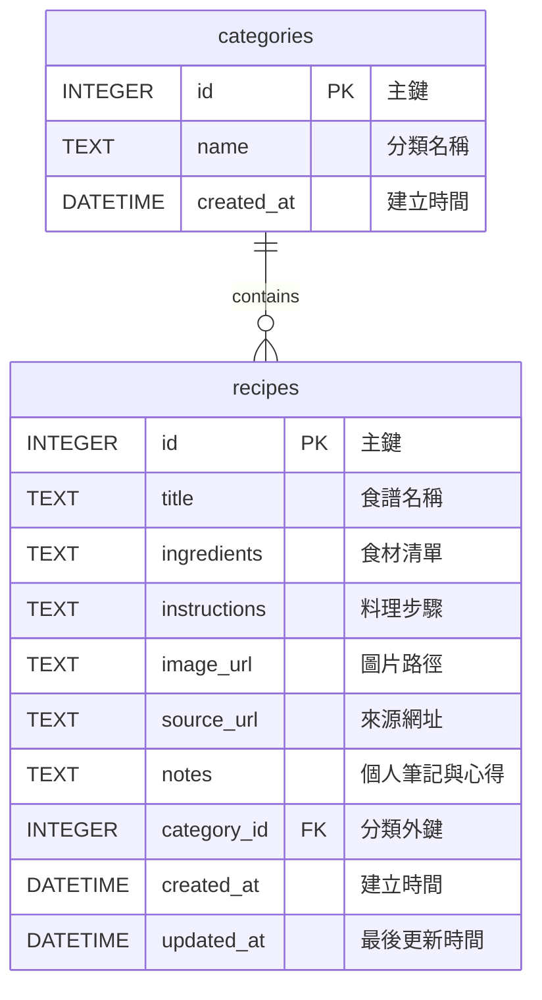

# 食譜收藏系統 - 資料庫設計 (DB Design)

這份文件定義了本系統所需的 SQLite 資料表結構，包含實體關係圖（ER Diagram）與各欄位的詳細說明。

## 1. ER 圖（實體關係圖）

本系統目前具備兩個主要資料表：`categories`（食譜分類）與 `recipes`（食譜），兩者為「一對多」的關聯。一個分類可以包含多個食譜，而一個食譜僅屬於一個分類。

## 2. 資料表詳細說明

### 2.1 `categories` 表 (食譜分類)
用於管理各種自訂的食譜分類，如：家常菜、甜點、減脂餐等。

| 欄位名稱 | 資料型別 | 約束條件 | 說明 |
| :--- | :--- | :--- | :--- |
| `id` | `INTEGER` | `PRIMARY KEY AUTOINCREMENT` | 分類唯一識別碼 |
| `name` | `TEXT` | `NOT NULL UNIQUE` | 分類名稱，不可重複 |
| `created_at`| `DATETIME` | `DEFAULT CURRENT_TIMESTAMP` | 紀錄建立時間 |

### 2.2 `recipes` 表 (食譜內容)
儲存每道食譜的詳細內容與個人筆記。

| 欄位名稱 | 資料型別 | 約束條件 | 說明 |
| :--- | :--- | :--- | :--- |
| `id` | `INTEGER` | `PRIMARY KEY AUTOINCREMENT` | 食譜唯一識別碼 |
| `title` | `TEXT` | `NOT NULL` | 食譜名稱 |
| `ingredients` | `TEXT` | `NULL` | 準備食材清單（可留空） |
| `instructions`| `TEXT` | `NULL` | 料理步驟說明（可留空） |
| `image_url` | `TEXT` | `NULL` | 圖片存放路徑或外部連結 |
| `source_url` | `TEXT` | `NULL` | 原始網頁連結（適用於網址匯入） |
| `notes` | `TEXT` | `NULL` | 試做心得或標籤備註 |
| `category_id` | `INTEGER` | `FOREIGN KEY` | 關聯至 `categories(id)`，可為 NULL 表示未分類 |
| `created_at` | `DATETIME` | `DEFAULT CURRENT_TIMESTAMP` | 紀錄建立時間 |
| `updated_at` | `DATETIME` | `DEFAULT CURRENT_TIMESTAMP` | 紀錄最後更新時間 |

## 3. SQL 建表語法與 Model 程式碼
- **建表語法**：已產出於 `database/schema.sql`，並於 `instance/database.db` 初始化完成。
- **Python Models**：採用輕量化原生 `sqlite3` 實作，存放於 `app/models/` 目錄下，包含 CRUD 方法。
