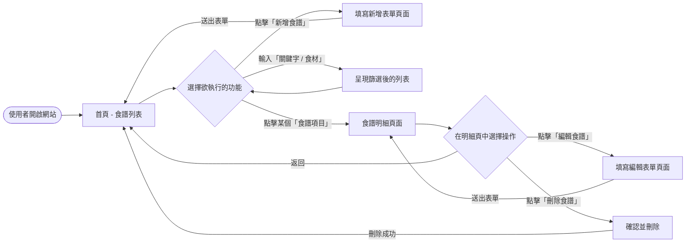
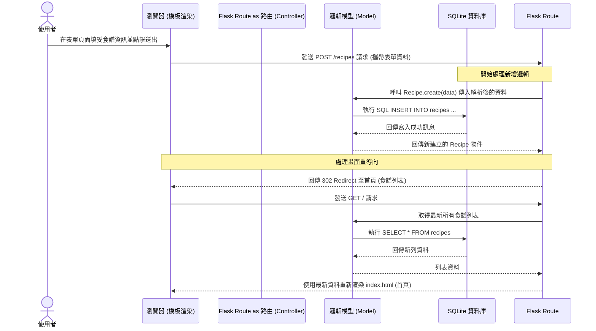

# 流程圖設計文件：食譜管理系統

本文件根據產品需求文件 (PRD) 與系統架構文件，視覺化使用者在食譜管理系統中的操作流程、系統背後的處理步驟，以及功能與路由的對照表。

## 1. 使用者流程圖（User Flow）

以下流程圖說明當使用者開啟網頁後，可以執行的各項功能及頁面轉換路徑：

## 2. 系統序列圖（Sequence Diagram）

以下序列圖以核心功能**「新增食譜」**為例，展示從使用者介面送出資料到成功寫入資料庫並重導向的完整過程：

## 3. 功能清單對照表

對應上述流程與 PRD 需求，以下為系統功能對應的 URL 路徑與 HTTP 方法整理，提供後續 API/路由設計的參考：

| 功能項目說明 | HTTP 方法 | 預計對應的 URL 路徑 | View (Jinja2) | 備註 |
| --- | :---: | --- | --- | --- |
| **首頁 / 所有食譜總覽** | `GET` | `/` 或 `/recipes` | `index.html` | 可結合查詢參數 `?q=關鍵字` 處理搜尋與食材推薦功能。 |
| **進入新增食譜表單頁** | `GET` | `/recipes/new` | `form.html` | 呈現空白的輸入表單。 |
| **提交新增食譜資料** | `POST` | `/recipes` | *(處理無畫面)* | 處理完後 302 重導向回首頁。 |
| **查看單一食譜明細** | `GET` | `/recipes/<id>` | `show.html` | 顯示特定 ID 的食譜完整步驟與內容。 |
| **進入編輯食譜表單頁** | `GET` | `/recipes/<id>/edit` | `form.html` | 呈現帶有原始資料的編輯表單。 |
| **提交更新的食譜資料** | `POST` | `/recipes/<id>/update` | *(處理無畫面)* | 使用 HTML form 故用 POST，更新完成後重導回明細頁。 |
| **確定刪除食譜** | `POST` | `/recipes/<id>/delete` | *(處理無畫面)* | 使用 form 觸發 POST，刪除完成後重導回首頁。 |
