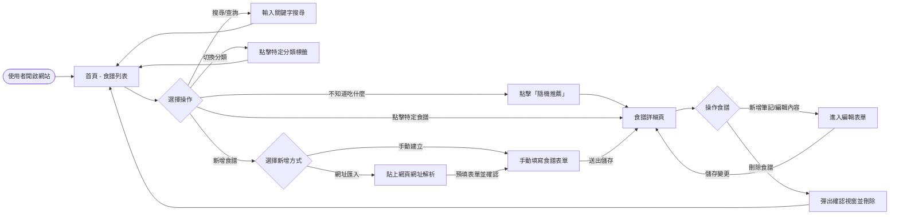
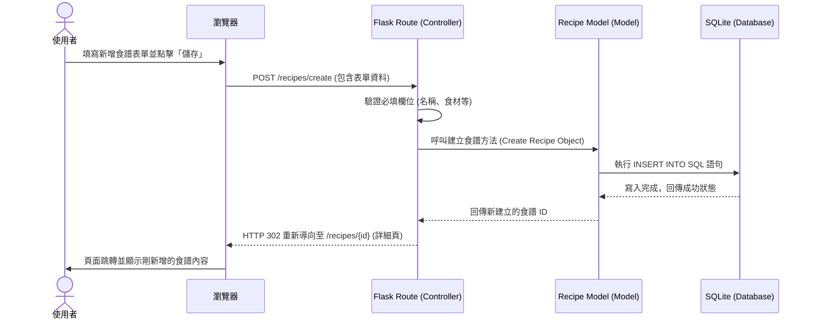

# 食譜收藏系統 - 流程圖與資料流設計 (Flowchart)

本文件基於 PRD（產品需求文件）與 Architecture（系統架構），視覺化使用者的操作路徑與系統內部的資料處理流程。

## 1. 使用者流程圖（User Flow）

此流程圖描述使用者從進入網站（首頁）開始，如何操作各項主要功能（搜尋、新增、分類、隨機推薦、查看詳細與編輯筆記等）。

## 2. 系統序列圖（Sequence Diagram）

以下以「**使用者新增食譜**」這個核心情境為例，描述從前端送出表單到後端存入 SQLite 資料庫的完整資料流。

## 3. 功能清單對照表

在接下來的開發中，我們將需要實作以下路由（Routes）以對應上述的流程圖操作：

| 功能名稱 | URL 路徑 | HTTP 方法 | 說明 |
| :--- | :--- | :--- | :--- |
| **瀏覽食譜列表 (首頁)** | `/` 或 `/recipes` | `GET` | 顯示所有食譜，支援分類或關鍵字搜尋的 Query String |
| **新增食譜 (顯示表單)** | `/recipes/create` | `GET` | 顯示手動新增食譜的 HTML 表單 |
| **新增食譜 (送出資料)** | `/recipes/create` | `POST` | 接收表單資料並寫入資料庫 |
| **網址快速匯入預覽** | `/recipes/import` | `POST` | 接收外部網址，後端嘗試解析並回傳至建立表單 |
| **查看食譜詳細內容** | `/recipes/<id>` | `GET` | 根據 ID 查詢資料庫並顯示單一食譜內容與筆記 |
| **編輯食譜與筆記 (表單)**| `/recipes/<id>/edit` | `GET` | 顯示包含既有資料的編輯表單 |
| **編輯食譜與筆記 (儲存)**| `/recipes/<id>/edit` | `POST` | 接收更新資料並複寫資料庫內容 |
| **刪除食譜** | `/recipes/<id>/delete` | `POST` | 從資料庫中刪除指定 ID 的食譜，為防 CSRF 建議用 POST |
| **隨機推薦食譜** | `/recipes/random` | `GET` | 從資料庫中隨機撈取一筆食譜並重導向至其詳細頁面 |
| **管理分類標籤** | `/categories` | `GET` / `POST` | 查看與新增自訂的分類標籤 |
